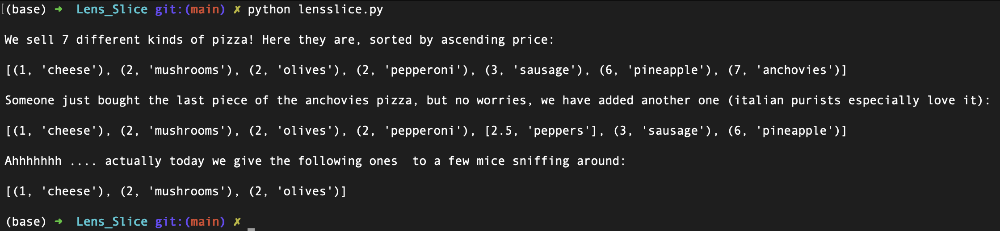

# Len's Slice

### What does it do ?
> Prints few list, getting updated as the program progresses. Lists record the buying/selling activity going on in a pizzeria named "Len's Slice"

### How does it looks like ?
> 

### How do i use it ?
> Just run it using Python.

### How was it done ?
> Using CLI, Emacs, and Python

### Why ?
> CodeCademy project that i reformatted for training purposes.
> Done to train myself on lists